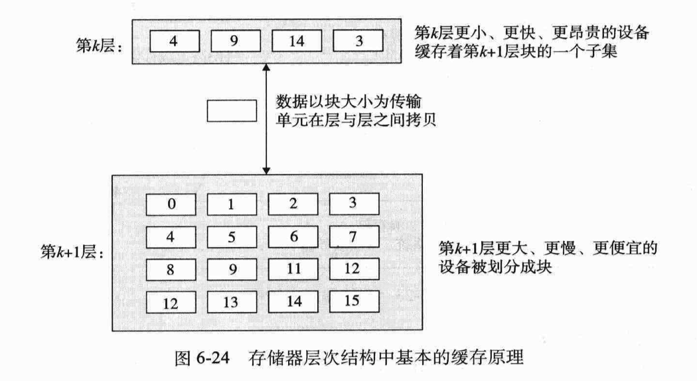
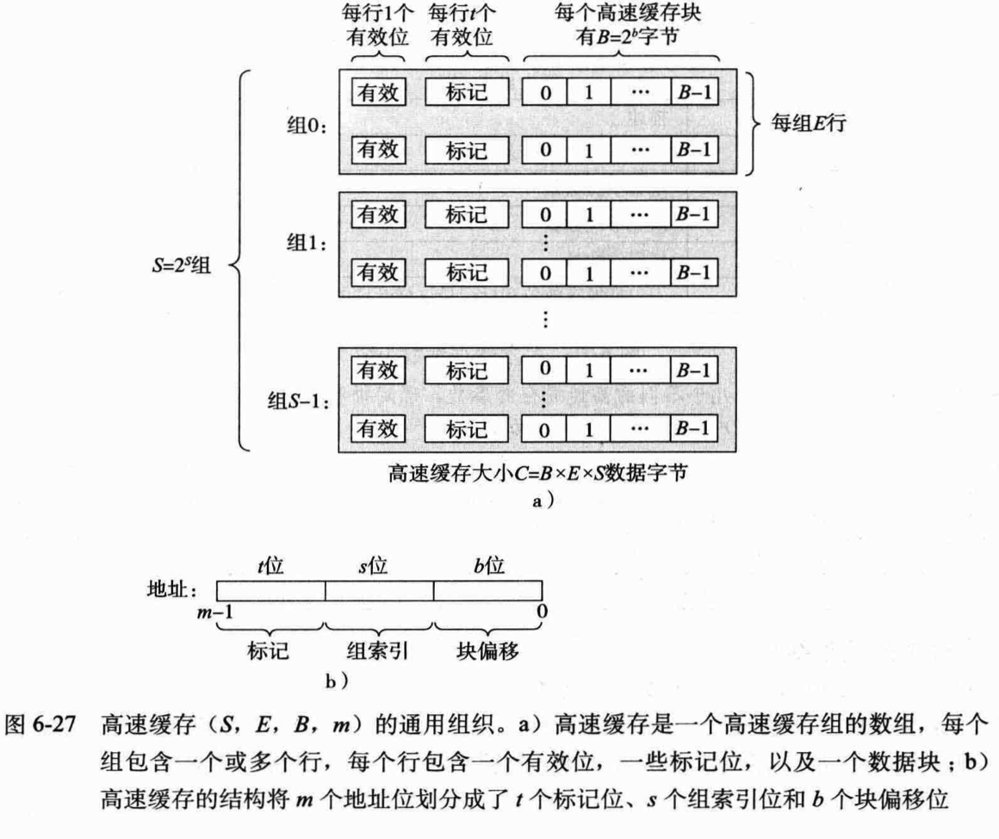
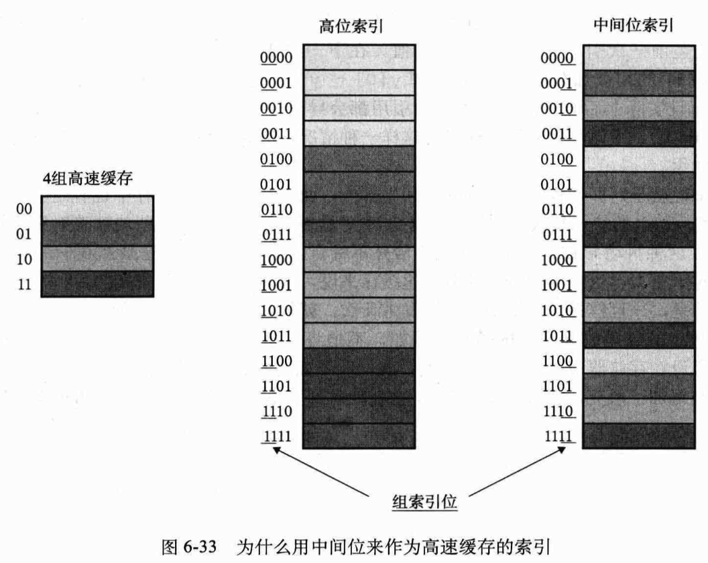

## 常见术语

### 约定

位于 k 层的存储设备是位于 k+1 层的缓存

k 层更快更小, k+1 层更大更慢

### 块

block

k 层的块较少，但每个块的大小和 k+1 层的块大小一样

是两层存储器间的传递单元

### 抖动

高速缓存对某个块进行反复地加载和驱逐

就是在 cpu 和主存间跑来跑去，其实只要把这些数据内容存储到缓存里不同的块就可以了

## cache 结构

第 k+1 层的 `block` 

* cache 的地址：标记位 + 块偏移位
  * 因为已经分好组了，由电路实现索引，cache 地址里不需要写出 `组索引位`

### 用低位做索引

用高位做索引，由于空间局部性，很容易抖动

## 总结

块：仓库的柜子，传递的单元

可以这样比喻，存储器一层层建好，跟 cpu 的距离越来越远，最远的地方（主存）就是一个总仓库，为了节省跑腿时间，将总仓库的数据复制出来，放在近的地方。越近的地方仓库容量越小，所以每段时间内只能放一小部分（需要频繁替换）。

当 cpu 需要使用一个数据，这个数据的原始标本放在总仓库的某个地方，当跑腿时间太长，如果在近处仓库有这个数据的 copy，就不需要到总仓库拿了。那么问题就是，先判断近处仓库的小柜子里所存储的数据，是不是就是那份 copy。（这就是所谓的缓存命中判断）

如果缓存不命中，就要到下一层（设为 k+1层）里去找，继续这个过程。如果在下一层找到了，就返回，同时要将这份数据存入 k 层仓库里。（这个过程可能会覆盖一个现成的块）

这样的话，又出现一个放置策略的问题。数据是不是任意柜子都能放？（只要有空位）还是对特定的数据，只能放入特定的柜子？

