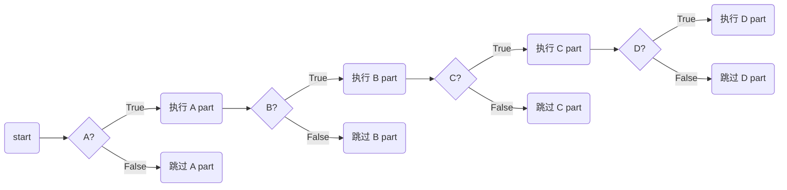
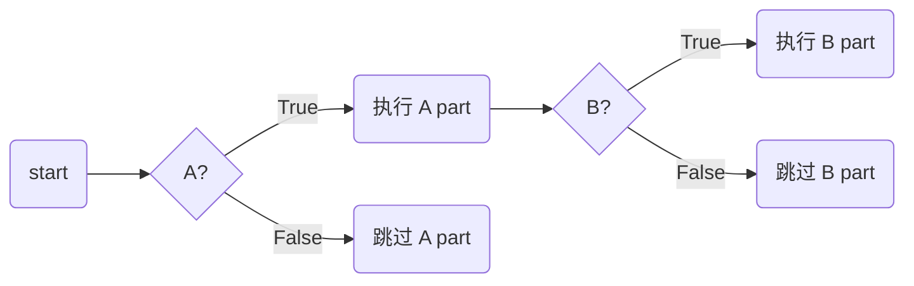
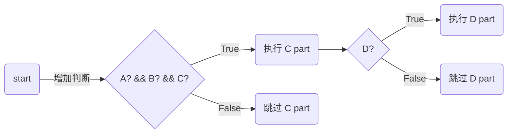

建议避免超过 3~4 层以上的嵌套

## 一些避免深层嵌套的方法

### 对于嵌套的 if 语句

#### 通过拆分嵌套（需要重复检测某些条件）来减少嵌套层次

`toExemplify-book`

作为代价，你必须要容忍使用一个更加复杂的判断。但如果可以大幅减少桥嵌套层次的话，值得考虑

##### 拆分图示

这个大的嵌套：



拆分成两个小嵌套 （第二个嵌套中要重复检测在第一个嵌套里的条件）




交叉参考 17.3节[[错误处理和 goto]]

#### 用 break 块来简化循环里的嵌套 if

`toReRead`

注意，在 python 中，`break` cannot be used to break out of an `if` - it can only break out of `loops`. （不过你也可以用 return 来实现这一功能）

```python
def deep_loop(s):
    if 1 <= s:
        print('1')
        if 2 <= s:
            print('2')
            if 3 <= s:
                print('3')
                if 4 <= s:
                    print('4')
def use_break(s):
    for i in range(1):
        if s < 1:
            break
        print('1')
        if s < 2:
            break
        print('2')
        if s < 3:
            break
        print('3')
        if s < 4:
            break
        print('4')

while True:
    n = input('n:')
    n = int(n)
    print('deep_loop:')
    deep_loop(n)
    print('use_break:')
    use_break(n)
```

不过 python 中有 `elif`，也比较方便了

其他语言未尝试，`toExemplify-book`

注意，这一技巧很不常见，要和团队商量，团队熟悉、接受后才能使用

#### 把嵌套 if 转换为一组 if-then-else 语句

`toNote`

类似于 python 中 `elif`

#### 把嵌套 if 转换成 case 语句

在一些情况下可以利用 case 语句重写，特别是含有整数的判断

`toNote`

### 其他

#### 将深层嵌套的代码抽取为单独的子程序

当嵌套是由于条件和迭代二者共同产生的，这么做特别有效。把 if-then-else 分支保留在主循环中（以便显示决策的分支走向），然后将各分支中的复杂语句提取为单独的子程序，再调用

`toExemplify-book` —— important！

#### 使用一种更加面向对象的方法

`toExemplify-book` —— important！

这个还不熟悉——但隐约有些懂了

#### 重新设计深层嵌套的代码

>  复杂的代码表明你还没有充分理解你的程序，所以无法简化它

`toNote`

## 总结

有些技术在其他章节

`toNote`